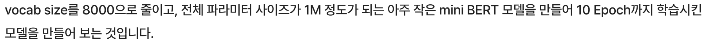
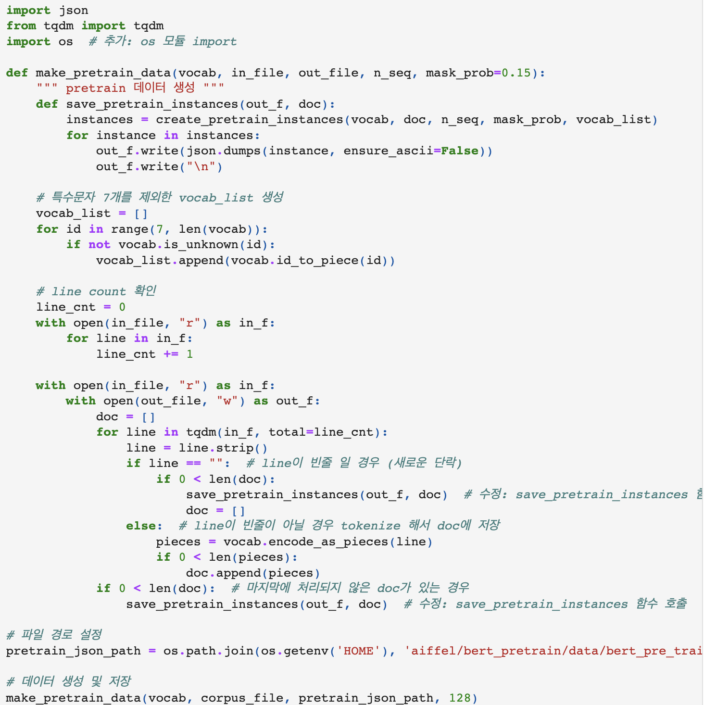

# AIFFEL Campus Online Code Peer Review Templete
- 코더 : 김연수
- 리뷰어 : 윤상현


# PRT(Peer Review Template)
- [ ]  **1. 주어진 문제를 해결하는 완성된 코드가 제출되었나요?**
    - 80% 정도 완료하였습니다.
    
    
- [ ]  **2. 전체 코드에서 가장 핵심적이거나 가장 복잡하고 이해하기 어려운 부분에 작성된 
  주석 또는 doc string을 보고 해당 코드가 잘 이해되었나요?**
    - 네, 주석이 섬세하게 달려있어서 이해하기 편했습니다.
    

- [ ]  **3. 에러가 난 부분을 디버깅하여 문제를 “해결한 기록을 남겼거나” 
  ”새로운 시도 또는 추가 실험을 수행”해봤나요?**
    - 진행 중에 있는 것으로 보입니다.
    - 기존 타 작업들의 기록으로 봤을 때, 완료하실 것 같습니다.
     
  
- [ ]  **4. 회고를 잘 작성했나요?**
    - 아직 프로젝트를 완료하지 못 하여서 회고는 없습니다.
    - 추후 추가하실 것으로 예상됩니다.
    
- [ ]  **5. 코드가 간결하고 효율적인가요?**
    - 네, OOP의 특징을 잘 살려 구성됐고, 읽기 편했습니다.
     


# 참고 링크 및 코드 개선
```
-
```
