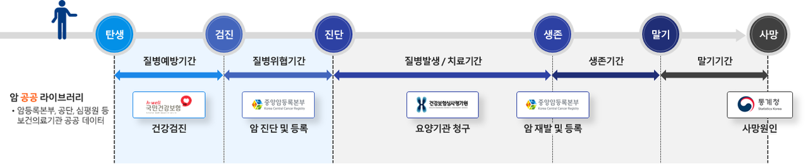

# 복지부, 198만 명 암환자 빅데이터 개방... K-CURE 포털 통해 암 공공 라이브러리 데이터 개방

## 암 정복 연구와 인공지능, 빅데이터 분석 모델 등 헬스케어 서비스 개발에 활용 등으로 국민건강을 크게 기여할 것

### reviewer: 홍서이

보건복지부 장관, 국립암센터 원장, 한국보건의료정보원장은 6월 20일부터 정부와 공공기관이 보유한 암 환자 데이터를 결합한 **K-CURE 암 공공 라이브러리**를 학계, 산업계 등 연구자에게 개방하기로 결정했다.

이러한 데이터 개방은 암 정복 연구와 인공지능, 빅데이터 분석 모델 등 헬스케어 서비스 개발에 활용되며 **국민 건강에 크게 기여할 것**으로 기대된다.

제공되는 데이터에는 통계청의 사망 정보, 암 등록자료, 자격 검진정보, 의료이용 청구정보 등을 결합한 2012년부터 2019년 까지의 암 환자 198만명의 빅 데이터로, 암 진단 이전부터 사망에 이르기까지의 암 환자 전 주기 데이터를 포함한다.

연구자는 [K-CURE 포털](https://k-cure.mohw.go.kr/)에서 활용 신청을 통해 데이터 활용을 신청할 수 있다.

이러한 데이터 공유를 통해 연구자들은 여러 기관의 데이터를 결합하고 처리하는데 들었던 시간, 비용을 단축하고 환자의 개인정보를 철저히 보호하면서 연구 성과를 창출할 수 있다.

보건복지부 은성호 첨단의료지원관은 *암 공공 라이브러리는 암 환자 생애 전 주기에 걸친 정보를 포괄하여 연구 가치가 높다.* 라고 말하며, *예후 진단과 합병증 예측 등 심도 있는 암 정복 연구와 헬스케어 서비스 개발에 활용되어 국민건강을 크게 증진할 것으로 기대한다.* 라고 밝혔다. 

### 원본기사 출처
[박현진, "복지부, 198만 명 암환자 빅데이터 개방... K-CURE 포털 통해 암 공공 라이브러리 데이터 개방", 2023.06.19.](https://www.aitimes.kr/news/articleView.html?idxno=28300)

